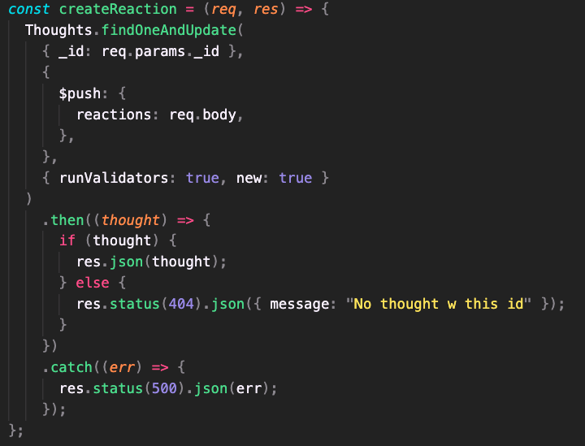
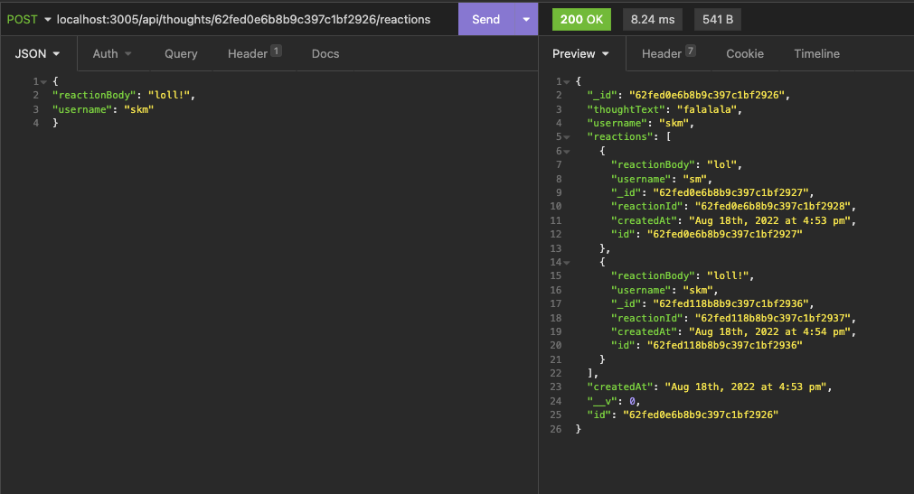

# Social Network API - NoSQL

## License

This repo is licensed by MIT

[](https://opensource.org/licenses/MIT)

## Description

Using MongoDB, Express, Node, and JavaScript, models, controllers, and routes are created in order for a social network API to be created. A user can be created, updated, and deleted. All users and a single user's data can be viewed. A thought can be created, updated, and deleted. All thoughts and a single thought's data can be viewed. A reaction to a thought can be created and deleted. A friend can be created and deleted to the user.

## Table of Contents

- [Installation](#installation)
- [Technologies](#technologies)
- [Demo Link](#demo%20link)
- [Usage](#usage)
- [User Information](#user%20information)
- [Credits](#credits)
- [Tests](#tests)
- [Questions](#questions)

## Installation

To install necessary dependencies, run the following command:

```ruby
npm i
```

## Technologies

- MongoDB
- JavaScript
- Node.js
- Express

## Demo Link

[Demo Link](https://www.youtube.com/watch?v=5Ox39rB0SMs)

## Usage

### Code Snippet



#### Code Snippet of posting a reaction that updates the reactions array in the thoughts model.

###



#### Screenshot of reaction being adding using Insomnia.

## User Information

[Github](https://github.com/smandla) |
[Email](mandla21@up.edu) |
[LinkedIn](https://www.linkedin.com/in/srikavya-mandla/) |
[Portfolio](https://smandla.github.io/kavya_professionalportfolio/)

## Tests

To run tests, run the following command:

```ruby
npm test
```

## Questions

If you have any questions about the repo, open an issue or contact me directly at mandla21@up.edu.

---

© 2022 Trilogy Education Services, LLC, a 2U, Inc. brand. Confidential and Proprietary. All Rights Reserved.
